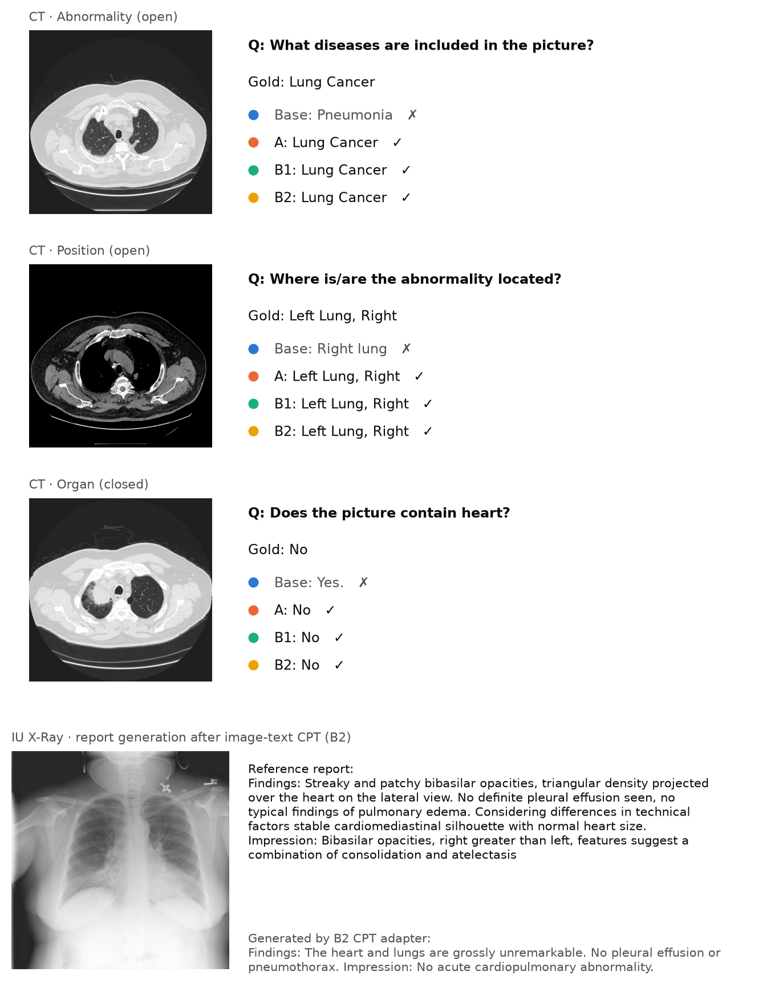

# Parameter-Efficient Continued Pre-training and Instruction Tuning of a Medical Vision-Language Model

**Course project, Topic 6 (Task 1.3)** · Draft v0.7, 2026-09-23 · Author: Chunqian Loo

> **Draft status.** Sections 3, 4, 5 and 6 are written from the repository as it stands. Experiments 0, A, B1, B2, C1, C2-300 and the A-server control are complete. Section 2 (Related Work) is written, with the bibliography in `docs/refs.bib` — every entry there still needs checking against the actual paper. Everything marked `[TODO]` still needs work. Repository: https://github.com/AugustLoo/MedLoRA

---

## Abstract

Open-weight vision-language models (VLMs) in the 2–7B range answer general visual questions well but lag on medical images. This project studies a parameter-efficient adaptation pipeline, continued pre-training (CPT) followed by LoRA/QLoRA supervised fine-tuning (SFT), for Qwen2.5-VL-3B-Instruct, with three fixed evaluation tables: medical VQA (SLAKE), general-ability retention (TextVQA subset) and answer reliability (PubMedQA). QLoRA SFT on 4.9k SLAKE questions raises closed-question accuracy from 67.3 to 85.1 and open-question recall from 46.7 to 82.2 with no measurable loss on TextVQA. A text-only CPT stage on 10k PubMed abstracts does not transfer to image questions (SLAKE unchanged within ±0.6) but improves text-only medical reasoning (PubMedQA +2.2). An image-text CPT stage on 3.5k IU X-Ray image-report pairs learns the radiology report style but not the findings, and leaves SLAKE unchanged (closed 84.1) while lowering open lesion questions; in this regime, a 3B model with a frozen vision tower and a few thousand CPT examples, the CPT stage does not contribute to the primary metric. Evaluating the CPT-stage adapters without SFT localises a persistent "yes" bias to the short-answer SFT data rather than to CPT or to the base model. Acting on that diagnosis, mixing 900 three-class text examples into the SFT set (experiment C1) raises PubMedQA macro-F1 from 51.5 to 61.1 and triples the number of correctly answered "maybe" questions, at a cost of 2.2 points of general VQA accuracy and roughly one net SLAKE question; a single-variable control run on the same GPU isolates that trade-off to the replay data itself. Varying the replay budget shows the calibration gain saturates by 300 examples (94 % of the 900-example gain at half the retention cost and no main-task cost), while the per-class balance of the fix continues to improve up to 900. A second, broader retention probe (MMBench, 500 fixed multiple-choice questions) shows no replay cost at all, which localises the measured loss to short-answer output format rather than to visual ability. The alignment problem in this pipeline is therefore a data-mixture problem, addressable without a separate preference-optimisation stage. All adapters, data-generation scripts, evaluation code and configurations are released for one-command reproduction.

---

## 1. Introduction

Large VLMs such as Qwen2.5-VL and LLaVA are trained on web-scale natural images. Radiology and pathology images are rare in that data, so out of the box these models mislabel organs, confuse modalities and hedge poorly on medical questions. Full fine-tuning of even a 3B model is out of reach for a single consumer GPU, which motivates parameter-efficient methods: low-rank adapters (LoRA) and their 4-bit variant (QLoRA) train under 2% of the parameters and fit on a 16 GB card.

Task 1.3 of the course asks for a complete pipeline on a 2–7B open VLM: (1) continued pre-training on medical corpora, (2) LoRA/QLoRA instruction tuning, (3) an alignment step, with four deliverables: data-generation scripts, the CPT/SFT pipeline with adapters, evaluation sets with model cards, and a report with reproducible configurations.

This report makes the following contributions:

1. A reproducible three-table evaluation protocol (medical VQA, general retention, reliability) shared by every experiment, with prompts fixed once and used identically for training data generation and evaluation.
2. A controlled comparison of SFT alone versus CPT followed by SFT, on the same base model, adapter rank, learning schedule and evaluation seed.
3. Evidence that text-only CPT does not transfer to image questions, motivating image-text CPT on chest X-ray reports (IU X-Ray, then CheXpert Plus).
4. A question-type error analysis that separates "vocabulary alignment" gains from genuine gains in medical perception.

The rest of the report is organised as follows. Section 2 reviews related work. Section 3 describes the pipeline. Section 4 gives the datasets and experimental setup. Section 5 reports results, Section 6 discusses them, Section 7 lists limitations and planned work, and Section 8 gives reproduction instructions.

---

## 2. Related Work

**Open vision-language models at the 2–7B scale.** Contemporary open VLMs share an architecture:
a ViT vision tower, a projector that maps visual features into the language model's embedding
space, and a decoder-only LLM. LLaVA \citep{liu2023llava} established visual instruction tuning as
the standard recipe, and the Qwen2-VL / Qwen2.5-VL line \citep{wang2024qwen2vl, bai2025qwen25vl}
added dynamic-resolution visual tokens, which matters here because it lets a 3B model take a
512×512 radiograph without a fixed-grid resize. Earlier few-shot multimodal work such as Flamingo
\citep{alayrac2022flamingo} used frozen backbones with cross-attention adapters; the projector-based
design has since become dominant because it fine-tunes more cheaply. This project takes
Qwen2.5-VL-3B-Instruct as given and asks what can be added to it under a 16 GB memory budget.

**Medical vision-language models.** LLaVA-Med \citep{li2023llavamed} is the closest reference point:
it adapts LLaVA to biomedicine in two stages — caption-style alignment on PMC figure-caption pairs,
then instruction tuning on generated biomedical dialogues. Med-Flamingo \citep{moor2023medflamingo}
pursues few-shot medical reasoning from interleaved textbook data, and Med-PaLM M
\citep{tu2024medpalmm} scales a generalist biomedical model far beyond the compute available here.
**Our experiment B2 is a deliberately small-scale reproduction of LLaVA-Med's first stage**: caption
loss over image-report pairs with a frozen vision tower. The result — the adapter learns the report
template and not the findings — is reported as a negative result about that stage at this scale,
not as a criticism of the original work, which uses two orders of magnitude more data and trains the
projector.

**Parameter-efficient adaptation.** LoRA \citep{hu2022lora} injects trainable low-rank matrices into
frozen weights; QLoRA \citep{dettmers2023qlora} adds a 4-bit NF4 quantised base and paged optimisers,
bringing 7B-scale fine-tuning within a single consumer GPU. Both are reported to approach full
fine-tuning on instruction-following tasks at a fraction of the memory. All training here runs
through LLaMA-Factory \citep{zheng2024llamafactory}, with 0.79 % of parameters trainable and the
vision tower frozen throughout — a choice that makes every measured change attributable to the
language model, and that also bounds what the CPT stages could possibly achieve.

**Domain-adaptive continued pre-training.** Gururangan et al. \citep{gururangan2020dapt} showed that
continued pre-training on in-domain text reliably helps in-domain downstream tasks, and
domain-specific encoders such as PubMedBERT \citep{gu2021pubmedbert} make the same case for
biomedicine. That literature is almost entirely unimodal. **The question this project actually tests
is whether the finding survives a modality gap**: does continued pre-training on biomedical
*text* improve a *visual* question-answering task? Experiments B1 and B2 answer no at this scale,
while confirming that text CPT does help the text-only reliability table — the gain stays inside its
own modality.

**Forgetting and replay.** Rehearsal — mixing samples from the original distribution into new
training — is the oldest remedy for catastrophic forgetting \citep{robins1995rehearsal}, alongside
regularisation approaches such as EWC \citep{kirkpatrick2017ewc}. LoRA is often argued to forget less
than full fine-tuning simply because it changes less. This project uses replay for an unusual
purpose: not to preserve a previous *task*, but to preserve a previous *answer format*. The
three-class PubMedQA examples mixed into the SFT set (experiments C1, C2) exist to stop the model
losing the ability to say "maybe", and the general-ability probe then measures what that costs.

**Alignment and calibration.** The standard third stage after instruction tuning is preference
optimisation, whether RLHF \citep{ouyang2022instructgpt} or the simpler DPO
\citep{rafailov2023dpo}. Separately, a long line of work documents that neural networks are poorly
calibrated \citep{guo2017calibration} and that language models have some latent, recoverable sense
of their own uncertainty \citep{kadavath2022know}. **This project's main finding sits between those
two literatures**: the reliability failure it measures is not inherited from pre-training but
*manufactured by the instruction-tuning data*, and correcting the stage-2 data mixture recovers most
of it without a preference-optimisation stage at all. Section 5.5 quantifies both the recovery and
its cost.

**Benchmarks and data.** Medical VQA is evaluated on SLAKE \citep{liu2021slake}, chosen over VQA-RAD
\citep{lau2018vqarad} and PathVQA \citep{he2020pathvqa} for its size, its English subset and its
question-type annotations, which make the error analysis in Section 5.2 possible. Reliability is
measured on PubMedQA \citep{jin2019pubmedqa}, whose three-way {yes, no, maybe} label is what makes
hedging measurable at all. General-ability retention uses TextVQA \citep{singh2019textvqa}; its
limitations as a probe are discussed in Section 6, and MMBench \citep{liu2023mmbench} is the planned
replacement. Image-report pairs come from IU X-Ray / OpenI \citep{demnerfushman2016openi}, with
CheXpert Plus \citep{chambon2024chexpertplus} — the report-augmented extension of CheXpert
\citep{irvin2019chexpert} — registered for the scale-up; MIMIC-CXR
\citep{johnson2019mimiccxr} was in the original task description but was replaced for access
reasons (Section 4.1). Model and data documentation follows the model-card convention
\citep{mitchell2019modelcards}.

**Position of this work.** Nothing here is a new method. The contribution is a controlled
measurement on one small open model under a fixed compute budget: three evaluation tables held
constant across eight adapters, a single-variable control run to separate hardware from data
effects, per-question predictions stored so every number is recomputable, and one negative result
(CPT does not cross the modality gap at this scale) reported as carefully as the positive one
(the calibration failure is a data-mixture artefact and is fixable as such).

---

## 3. Method

### 3.1 Pipeline overview

```
base model ──► (stage 1) CPT adapter ──► (stage 2) SFT adapter ──► (stage 3) alignment  [planned]
Qwen2.5-VL-3B     medical corpus           SLAKE train                 preference data
                  text or image-text       instruction format          (yes/no/maybe calibration)
```

Each stage produces a LoRA adapter on the same frozen 4-bit base. Stage 2 is initialised from the stage-1 adapter (`adapter_name_or_path`) and continues training the same low-rank matrices, so the final artefact is a single 120 MB adapter. Experiment A skips stage 1; experiments B1/B2 differ only in the stage-1 corpus.


*Figure 1. The three-stage pipeline. Every adapter is evaluated on the same three tables.*

### 3.2 Base model

Qwen2.5-VL-3B-Instruct (Apache-2.0): a 3.75B-parameter model with a native-resolution ViT, an MLP projector and a Qwen2.5 decoder. It was chosen because (i) it sits in the 2–7B range required by the task, (ii) it fits on a 16 GB T4 in 4-bit with room for activations, and (iii) it already follows short-answer instructions, which makes zero-shot baselines meaningful.

### 3.3 Parameter-efficient training (QLoRA)

- Base weights quantised to 4-bit NF4 with double quantisation (bitsandbytes); LoRA matrices and optimiser states in fp16.
- LoRA on every linear layer of the language model (`lora_target: all`), rank 16, α = 32, dropout 0.05. The vision tower and projector are frozen in all experiments, so any change in behaviour is attributable to the LLM side.
- Gradient checkpointing, effective batch 16 (2 × 8 accumulation), cosine schedule, seed 42. Training is done with LLaMA-Factory; one YAML per experiment under `configs/`.

### 3.4 Stage 1a: text-only CPT (B1)

Causal-LM loss on 10,000 PubMedQA `pqa_artificial` documents (question + abstract context + long answer, concatenated), packed into 1024-token sequences. Learning rate 5e-5 (half of SFT), one epoch. The evaluation split `pqa_labeled` is never used for training.

### 3.5 Stage 1b: image-text CPT (B2)

Caption-style alignment in the sense of LLaVA-Med stage 1: the input is a frontal chest X-ray plus a fixed instruction ("Write the radiology report for this chest X-ray."), the target is the report's Findings and Impression sections, and the loss is computed on the report tokens only. Implemented as an SFT-format dataset so that images are consumed; hyper-parameters as in 3.4. Corpus: IU X-Ray (see 4.1); CheXpert Plus is the planned scale-up.

### 3.6 Stage 2: instruction tuning (SFT)

SLAKE English training questions converted to a two-turn chat format with the same prompt templates used at evaluation time (`medvlm/prompts.py`):

- closed questions: `{question}\nAnswer with yes or no only.`
- open questions: `{question}\nAnswer with a single word or short phrase.`

Learning rate 1e-4, three epochs, images resized to at most 512×512 pixels (262,144), validation loss on the SLAKE validation split every 400 steps.

### 3.7 Stage 3: alignment

The PubMedQA results show a stable over-prediction of "yes" and under-prediction of "maybe". The original plan was DPO
on preference pairs built from PubMedQA `pqa_artificial` (preferred: the gold label; rejected: the model's
over-confident answer). Two findings changed that plan before it was implemented.

First, evaluating the CPT-stage adapters without SFT (Section 5.3) showed the bias is *introduced* by the short-answer
SLAKE SFT data: the CPT-only adapters are the best-calibrated models in the whole project, better than the base model.
The failure is created in stage 2, not inherited from pre-training, so a third stage would be correcting damage that a
stage-2 data change could avoid. Second, the direct test of that hypothesis (experiment C1, Section 5.5) recovers most
of the calibration by mixing 900 three-class text examples into the SFT set: macro-F1 51.45 → 61.09 with a measured
cost of 2.2 points of general VQA accuracy.

Stage 3 is therefore reframed as *SFT data-mixture design* rather than preference optimisation, and the remaining
question is quantitative: how much replay is enough, and how the calibration gain trades against retention.
Experiment C2 varies the replay budget to trace that curve; Section 5.6 reports the 0 / 300 / 900 points. DPO is
retained as an optional experiment E, to be run only if the data-mixture route saturates below acceptable
calibration — which, on the evidence so far, it does not.

---

## 4. Data and Experimental Setup

### 4.1 Datasets

| Dataset | Role | Size used | Licence / access |
|---|---|---|---|
| SLAKE (English) | SFT training; validation loss; **test set for medical VQA** | train 4,919 / val 1,053 / test 1,061 (416 closed, 645 open) | CC BY 4.0 |
| PubMedQA `pqa_artificial` | text CPT corpus | 10,000 documents | MIT |
| PubMedQA `pqa_labeled` | **reliability evaluation** (yes/no/maybe); from experiment C1 on, a fixed stratified half is also a three-class SFT source | 1,000, split 500 train / 500 test (seed 42, stratified) | MIT; the test half is never trained on |
| TextVQA validation | **general-ability retention** (short-answer) | fixed 300-question sample, seed 42 | CC BY 4.0 |
| MMBench (en, dev) | **general-ability retention** (multiple-choice, 20 ability dimensions) | fixed 500-question sample, seed 42 | see dataset card |
| IU X-Ray (OpenI, Kaggle mirror) | image-text CPT prototype | ≈3.3k frontal images with non-empty reports, 95/5 split by report id | public |
| CheXpert Plus | image-text CPT at scale (planned, B3) | 5k → 20k studies | registered; download pending |

MIMIC-CXR was in the original task description; CheXpert Plus was chosen instead because it provides the same image-report structure with a lighter access process (registration versus PhysioNet credentialing), and because it is the dataset shared with the Topic 1 teammate whose image-text alignment model will provide the data-filtering scores for B3.

Compliance rules fixed in the repository: SLAKE test and PubMedQA labeled are evaluation-only; patient-level splits are stored in git; controlled data and patient-level derived files never enter git or public Kaggle datasets.

### 4.2 Evaluation protocol

All three tables are produced by `train/eval_all.sh <tag> <adapter>` with greedy decoding (`do_sample=False`), at most 32 new tokens, images capped at 512×512, on the full-precision fp16 base plus adapter. Predictions are stored per question for error analysis.

| Table | Data | Metrics |
|---|---|---|
| Medical VQA | SLAKE test | closed: see the scoring note below; open: exact match, token recall (LLaVA-Med convention) and token F1, all after lower-casing, stripping punctuation and articles; both split by modality (X-Ray / CT / MRI) |
| General retention | TextVQA 300 | VQA accuracy, min(#matching annotators / 3, 1) |
| Reliability | PubMedQA labeled, **held-out half only from C1 on** | accuracy, macro-F1 over {yes, no, maybe}, predicted-label distribution versus gold (full 1,000: 552 / 338 / 110; held-out 500: 276 / 169 / 55) |
| General retention (2nd probe) | MMBench en-dev, 500 fixed | accuracy on the option letter (first A–D in the output); no circular evaluation; per-category breakdown stored |

**Scoring note on closed questions (corrected 2026-09-19).** SLAKE's CLOSED category is not purely yes/no: 61 of the 416 closed test questions have a closed-vocabulary gold answer such as *Lung*, *Liver*, *T2* or *Coronal Plane*. Our first implementation folded both prediction and gold through a yes/no/other mapping, so on those 61 questions any answer that was not literally "yes" or "no" collapsed to "other" and matched the gold, scoring as correct for free. This inflated every instruction-tuned adapter, which had learned to answer those questions with a content word, by 4 to 5 points; the zero-shot base was unaffected because it forced yes/no answers there and was scored correctly. Closed questions are now scored as yes/no agreement when the gold is yes/no, and as exact match otherwise (`medvlm.metrics.closed_score`). All numbers in Section 5 use the corrected scorer; `scripts/rescore_slake.py` recomputes them from the stored per-question predictions without re-running the models. The correction lowers experiment A from 89.18 to 85.10, B1 from 88.70 to 83.89 and B2 from 88.70 to 84.13, and leaves every conclusion unchanged.

**PubMedQA split protocol (introduced for C1).** Experiment C1 trains on PubMedQA text, so the reliability table
had to be split before it could be used as both a training source and an evaluation set. `data/split_pubmedqa.py`
draws a label-stratified 500 / 500 split with seed 42 and writes `data/pubmedqa_split.json`, which is committed to git
and refuses to be regenerated once it exists. The training half contributes 276 yes / 169 no / 55 maybe to experiment C1;
the held-out half has the same distribution and is never trained on. Because the earlier models were scored on all
1,000 questions, `scripts/eval_pubmedqa_split.py` recomputes every model's PubMedQA metrics on the held-out half from
the stored per-question predictions, so all runs are compared on one ruler without re-running any model. Sections 5.1
and 5.3 quote the full-1,000 numbers for continuity with the earlier draft; Section 5.5 and every comparison involving
C1 quote the held-out 500.

### 4.3 Hardware and cost

Experiments 0, A, B1 and B2 ran on Kaggle (one NVIDIA T4, 16 GB, fp16, 4-bit NF4 base). From experiment C1 on,
training moved to the college GPU server (one RTX 5090, 32 GB, bf16, **no quantisation**); a local RTX 3050 (4 GB) was
used only for code and smoke tests. The two platforms therefore differ in both numerical precision and quantisation,
which is why the baseline was re-evaluated on the server and why experiment A was re-run there (Section 5.5): the
baseline agrees to within one point on all five metrics and A-server reproduces A to within half a point, so figures
from the two platforms can be read on the same axis.

| Run | Samples | Wall time | Throughput |
|---|---|---|---|
| Baseline evaluation (3 tables) | – | ≈1.5 h | SLAKE 1,061 questions in 38 min |
| A: SLAKE SFT, 3 epochs | 4,919 × 3 | 4 h 28 min | 0.92 samples/s |
| B1: text CPT, 1 epoch | 10,000 packed | 2 h 39 min | 0.42 samples/s |
| B1: SFT after CPT | 4,919 × 3 | 4 h 07 min | 1.0 samples/s |
| B2: image-text CPT, 1 epoch | 3,483 image-report pairs | 1 h 19 min | 0.73 samples/s |
| B2: SFT after CPT | 4,919 × 3 | 4 h 38 min | 0.89 samples/s |
| *(below: RTX 5090, bf16, unquantised)* | | | |
| Baseline re-evaluation (3 tables) | – | ≈1 h | – |
| C1: SLAKE + PubMedQA replay SFT, 3 epochs | 5,819 × 3 | 1 h 25 min | 3.42 samples/s |
| A-server: SLAKE SFT, 3 epochs | 4,919 × 3 | 6 h 19 min | 0.65 samples/s |
| C2-300: SLAKE + 300 replay SFT, 3 epochs | 5,219 × 3 | 10 h 58 min | 0.40 samples/s |

The A-server and C2-300 runs are eight times slower per optimiser step than C1 on the same GPU (38–40 s versus
4.7 s) with the GPU idle 95 % of the time; C1 is the outlier, not the rule, and the cause was not identified and is recorded as an open operational issue in `docs/SERVER.md`
rather than as a property of the method. It does not affect the trained weights: A-server reproduces A's validation
loss to four decimal places.

### 4.4 Experiment matrix

| ID | Stage 1 | Stage 2 | Question answered | Status |
|---|---|---|---|---|
| 0 | – | – | zero-shot starting point | done |
| A | – | SLAKE SFT | gain from instruction tuning alone | done |
| B1 | text CPT (PubMedQA) | SLAKE SFT | does text CPT transfer to image VQA | done |
| B2 | image-text CPT (IU X-Ray) | SLAKE SFT | does image-report CPT transfer | done |
| B1/B2 CPT-only | stage-1 adapters, no SFT | – | what CPT itself changes | done |
| B3 | image-text CPT filtered by alignment score (CheXpert Plus) | SLAKE SFT | value of data-quality filtering | needs teammate interface |
| A-server | – | SLAKE SFT, bf16 on the 5090 | single-variable control for C1; does A survive the platform change | done |
| C1 | – | SLAKE SFT + 900 PubMedQA three-class examples | can the SFT data mix fix the "yes" bias, and what does it cost | done |
| C2 | – | as C1 with 300 / 900 replay examples (0 = A-server) | how much replay is enough; shape of the trade-off | 0, 300, 900 done; 1,800 deprioritised (§5.6) |
| C2-s43 | – | C2-300 repeated with sampling and training seed 43 | run-to-run variance of the 300-vs-900 comparison | prepared, waiting for GPU |
| D | ablations: rank 8/16/32, CPT size, lr, epochs | | which factor matters | planned |
| E (optional) | C + DPO | | reliability | deprioritised: C1 shows the data mix alone recovers calibration |

---

## 5. Results

### 5.1 Main table

| Metric | Base (0) | A: SFT | B1: text CPT → SFT | B2: image CPT → SFT |
|---|---|---|---|---|
| SLAKE closed acc | 67.31 | **85.10** | 83.89 | 84.13 |
| SLAKE open EM | 40.62 | 75.35 | **75.81** | 74.57 |
| SLAKE open recall | 46.73 | 82.17 | **82.72** | 81.61 |
| SLAKE open F1 | 47.53 | 81.56 | **82.07** | 80.88 |
| SLAKE closed, X-Ray / CT / MRI | 80.70 / 64.49 / 56.82 | 85.09 / 84.58 / 86.36 | 82.46 / 83.64 / 86.36 | 85.09 / 82.71 / 86.36 |
| TextVQA acc (retention) | 83.89 | 83.89 | 83.78 | 84.00 |
| PubMedQA acc | 65.80 | 70.60 | **72.80** | 70.80 |
| PubMedQA macro-F1 | 51.03 | 52.38 | **54.19** | 52.96 |
| PubMedQA predicted yes / no / maybe (gold 552 / 338 / 110) | 641 / 201 / 158 | 685 / 256 / 59 | 670 / 286 / 44 | 672 / 263 / 65 |

Training curves: A, train loss 0.736 → 0.082, validation loss 0.225 → 0.145 still decreasing at epoch 3; B1 CPT loss 1.96 → 1.75 over one epoch; B1 SFT validation loss 0.160 → 0.142; B2 CPT loss 2.17 → 1.06; B2 SFT validation loss 0.168 → 0.151. No NaN in any run.


*Figure 2. Main results across the three evaluation tables.*


*Figure 4. Training loss (line) and validation loss (dots) for each run.*

### 5.2 Results by question type (SLAKE test, accuracy; open questions use exact match)

| Type | n | Base | A | B1 | B2 | B1 − A | B2 − A |
|---|---|---|---|---|---|---|---|
| Position, open | 163 | 24.5 | 57.7 | 60.1 | 58.3 | +2.5 | +0.6 |
| Organ, closed | 154 | 75.3 | 90.9 | 90.3 | 89.6 | −0.6 | −1.3 |
| Abnormality, closed | 109 | 68.8 | 78.0 | 75.2 | 78.9 | −2.8 | +0.9 |
| Knowledge-graph, open | 109 | 22.0 | 72.5 | 69.7 | 70.6 | −2.8 | −1.8 |
| Organ, open | 99 | 23.2 | 84.8 | 83.8 | 84.8 | −1.0 | 0.0 |
| Modality, open | 75 | 92.0 | 94.7 | 94.7 | 94.7 | 0.0 | 0.0 |
| Quantity, open | 52 | 71.2 | 73.1 | 76.9 | 75.0 | +3.8 | +1.9 |
| Abnormality, open | 41 | 12.2 | 41.5 | 39.0 | **31.7** | −2.4 | **−9.8** |
| Modality / Plane / Colour / Size, closed | 91 | 26.9–78.6 | 84.6–100.0 | 84.6–100.0 | 84.6–100.0 | 0.0 | −1.4 |

Per-question changes: base → A fixed 328 questions and broke 30; A → B1 fixed 15 and broke 17; A → B2 fixed 13 and broke 22. On the X-ray subset alone (the CPT modality), B2 versus A is 74.5 versus 76.5 on open questions and 85.1 versus 85.1 on closed.


*Figure 3. SLAKE test accuracy by question type. The grey bar spans base → A; the largest gains are on vocabulary-bound types (Organ, KG, Colour, Plane), the smallest on Abnormality and Position.*

### 5.3 CPT-stage adapters evaluated without SFT

To separate what the CPT stage itself does from what the SFT stage overwrites, the two stage-1 adapters were evaluated directly, without stage 2.

| Metric | Base | B1 CPT only | B2 CPT only | A: SFT |
|---|---|---|---|---|
| SLAKE closed acc | 67.31 | 69.71 | 68.27 | 85.10 |
| SLAKE open EM / recall | 40.62 / 46.73 | 34.11 / 44.87 | 36.43 / 44.65 | 75.35 / 82.17 |
| TextVQA acc | 83.89 | 81.67 | 83.56 | 83.89 |
| PubMedQA acc / macro-F1 | 65.80 / 51.03 | 66.70 / 53.25 | 68.40 / 53.20 | 70.60 / 52.38 |
| PubMedQA predicted yes / no / maybe (gold 552 / 338 / 110) | 641 / 201 / 158 | 578 / 251 / 171 | **598 / 288 / 114** | 685 / 256 / 59 |

Three things follow. (i) CPT is not inert: closed accuracy rises by 2.6–3.1 points and PubMedQA by 0.9–2.6, but the gains are small and are entirely absorbed by the SFT stage, after which all adapters converge to the same scores. (ii) The drop in open-question exact match is not verbosity: CPT-only answers average 1.3–1.4 words, the same as the base. It is vocabulary drift concentrated in a few types (B1 CPT: Modality-open 92.0 → 53.3; B2 CPT: Plane-open 53.3 → 13.3, e.g. "Chest" answered as "Thorax"), which the SFT stage then realigns to the SLAKE vocabulary. (iii) The CPT-only models are the best-calibrated on PubMedQA: the B2 CPT adapter's label distribution (598 / 288 / 114) is the closest of all five models to the gold distribution. The "yes" bias and the collapse of "maybe" are therefore introduced by the short-answer SLAKE SFT, not by CPT and not by the base model. This relocates the alignment problem from stage 3 to the stage-2 data mix.

### 5.4 Experiment B2: what the image-text CPT stage learned

Before the SFT stage, the B2 CPT adapter was asked to write reports for three held-out IU X-Ray images. The generations are fluent, correctly structured radiology reports ("Findings: The heart is normal in size. The lungs are clear. No pneumothorax or pleural effusion. Impression: No acute cardiopulmonary abnormality."), but two of the three reference reports describe abnormalities (bibasilar opacities; a right pleural opacity with effusion) and both were reported as normal. The CPT loss fell from 2.17 to 1.06 in one epoch, so the objective was learned; what was learned is the dominant report template. In the IU X-Ray training split 36 % of reports are normal, and abnormal reports are still written mostly as negations ("no effusion"), so a caption loss with a frozen vision tower rewards the template rather than the image.



*Figure 6. Top: three SLAKE test questions the base model gets wrong and every fine-tuned model gets right. Bottom: an abnormal IU X-Ray held-out image; the B2 CPT adapter writes a fluent normal report.*

### 5.5 Experiment C1: three-class replay in the SFT mix, with a single-variable control

Section 5.3 located the "yes" bias in the short-answer SFT stage rather than in CPT or the base model. C1 tests that
diagnosis directly: keep experiment A's recipe unchanged and add 900 three-class text examples (300 per label, sampled
with replacement from the 500-question training half; "maybe" has only 55 unique items and is repeated about five
times) to the 4,919 SLAKE questions. Every other hyper-parameter matches A — rank 16, lr 1e-4, three epochs, effective
batch 16, seed 42, frozen vision tower.

Because A was trained on Kaggle in 4-bit fp16 and C1 on the server in unquantised bf16, the pair differed in three
things at once. **A-server** removes two of them: experiment A's configuration re-run on the server under C1's exact
conditions, leaving the 900 examples as the only difference.

**A-server reproduces A.** Across the platform change the two runs agree to within half a point everywhere, including
the validation loss:

| Metric | A (Kaggle, 4-bit fp16) | A-server (5090, bf16) | Δ |
|---|---|---|---|
| SLAKE closed / open EM / open recall | 85.10 / 75.35 / 82.17 | 85.34 / 75.50 / 82.07 | +0.24 / +0.15 / −0.10 |
| TextVQA | 83.89 | 83.56 | −0.33 |
| PubMedQA macro-F1 (held-out 500) | 51.69 | 51.45 | −0.24 |
| Final validation loss | 0.145 | 0.1446 | −0.0004 |

This validates reading Kaggle and server figures on one axis, and it independently reproduces Section 5.3's finding:
A-server makes 63 "no"→"yes" errors against the server baseline's 42, so the SFT stage pushes the model towards "yes"
regardless of hardware or quantisation.

**What the replay buys and what it costs.** All PubMedQA figures below are on the held-out 500 questions
(gold 276 / 169 / 55); SLAKE and TextVQA are the full test sets.

| Metric | Server base | A-server | C1 | C1 − A-server |
|---|---|---|---|---|
| PubMedQA macro-F1 | 48.66 | 51.45 | **61.09** | **+9.63** |
| PubMedQA accuracy | 64.00 | 68.80 | 71.60 | +2.80 |
| "maybe" answered correctly (of 55) | 7 | 6 | **19** | **+13** |
| "no" answered as "yes" | 42 | 63 | **26** | **−37** |
| Predicted yes / no / maybe | 320 / 97 / 83 | 356 / 112 / 32 | **269 / 151 / 80** | gold 276 / 169 / 55 |
| SLAKE closed | 66.35 | 85.34 | 84.13 | −1.21 |
| SLAKE open EM / recall / F1 | 40.93 / 47.19 / 47.92 | 75.50 / 82.07 / 81.19 | 76.12 / 82.19 / 81.32 | +0.62 / +0.12 / +0.13 |
| SLAKE closed, X-Ray / CT / MRI | 78.95 / 64.95 / 53.41 | 84.21 / 83.18 / 92.05 | 83.33 / 83.18 / 87.50 | −0.88 / 0.00 / −4.55 |
| TextVQA | 84.22 | 83.56 | **81.33** | **−2.23** |

Three readings follow.

*The calibration gain is real, not a shifted prior.* C1's macro-F1 rises 9.6 points, the largest single-intervention
move in the project, and its predicted distribution (269 / 151 / 80) is the closest of any model to gold. The gain is
not bought by guessing "maybe" more often: the base model also answers "maybe" 83 times but is right 7 times
(8.4 % precision), while C1 answers it 80 times and is right 19 (23.8 %) — comparable volume, roughly three times the
precision, and recall up from 12.7 % to 34.5 %. Precision and recall improve for all three labels simultaneously, and
the "no"→"yes" error count falls below the untuned base model's.

*SLAKE is essentially unchanged.* Closed accuracy loses 1.21 points (about five of 416 questions, concentrated in MRI)
and open exact match gains 0.62 (about four of 645), for a net change of roughly one question across the 1,061-question
test set. C1's validation loss during training (0.142) is also marginally better than A-server's (0.1446). The earlier
claim of "no cost on SLAKE" is therefore slightly too strong and is restated here as a small closed-question cost
offset by a small open-question gain.

*The cost lands on general ability, and the control attributes it.* TextVQA decomposes cleanly: the server baseline
scores 84.22, SLAKE SFT alone (A-server) takes it to 83.56 (−0.66, noise level), and adding the replay takes it to
81.33 (a further −2.23). The 2.9-point drop first observed for C1 against the baseline is therefore **not** caused by
instruction tuning; it is caused by mixing text-only examples into a vision-language SFT set. Per question, 14 of 300
get worse and 6 get better, and the average answer length is unchanged (1.39 → 1.43 words), so this is not verbosity:
about half the regressions are surface variants ("one penny" → "1 penny") and about half are genuine misreads
("Vietnam" → "us army").

The trade is explicit: 2.2 points of general VQA accuracy for 9.6 points of three-class macro-F1, a tripling of
correct "maybe" answers, and 37 fewer false "yes" answers on clinical questions. Whether that exchange rate is
favourable depends on the deployment; what matters methodologically is that it is now measured rather than assumed.
Section 5.6 turns the single point into a curve.

### 5.6 Experiment C2: how much replay is enough

C1's 900 examples were a guess. C2 varies the budget with everything else fixed; the A-server run is the
zero-replay point, so three points were available once a 300-example run finished. The 300-example sample is
100 per class from the same training half, sampled with replacement (the 55 unique "maybe" items repeat about
1.8×, versus 5.5× at 900). PubMedQA figures are on the held-out 500; SLAKE and TextVQA are full test sets.

| Replay | macro-F1 | acc | "maybe" correct | predicted yes / no / maybe | SLAKE closed | open EM | TextVQA |
|---|---|---|---|---|---|---|---|
| 0 (A-server) | 51.45 | 68.80 | 6 / 55 | 356 / 112 / 32 | 85.34 | 75.50 | 83.56 |
| **300** | **60.48** | 69.40 | **21 / 55** | 228 / 178 / 94 | **85.82** | 75.97 | **82.33** |
| 900 (C1) | 61.09 | 71.60 | 19 / 55 | 269 / 151 / 80 | 84.13 | 76.12 | 81.33 |

| Replay | yes P / R | no P / R | maybe P / R | "no"→"yes" | "yes"→"no" | dangerous flips |
|---|---|---|---|---|---|---|
| 0 | 71.1 / 91.7 | 75.9 / 50.3 | 18.8 / 10.9 | 63 | 18 | 81 |
| 300 | 84.6 / 69.9 | 74.7 / 78.7 | 22.3 / 38.2 | **14** | 32 | 46 |
| 900 | 81.8 / 79.7 | 78.8 / 70.4 | 23.8 / 34.5 | 26 | 19 | **45** |

Three findings, in decreasing order of confidence.

*The calibration gain saturates early.* The first 300 examples buy +9.03 macro-F1; the next 600 buy +0.60. The
marginal return falls from 3.0 points per hundred examples to 0.1 — a thirty-fold drop. Whatever mechanism
restores the three-class behaviour, it needs very little data to engage. This is the most useful practical
result in the project: the fix is cheap.

*Cost rises monotonically with budget, and at 300 the main task pays nothing.* TextVQA falls −1.23 at 300 and
−2.23 at 900. SLAKE closed accuracy is +0.48 at 300 and −1.21 at 900; open exact match rises slightly at both.
The 300-example point therefore dominates the 900-example point on cost while capturing 94 % of the macro-F1
gain — and the earlier statement that C1's SLAKE cost was "offset" is superseded by the cleaner observation that
a smaller budget has no such cost to offset.

*The cost is confined to short-answer format.* A second retention probe run after the above — MMBench, 500 fixed
multiple-choice questions across 20 ability dimensions — moves 0.00 at 300 and +0.60 at 900 relative to zero
replay (base 88.40, A-server 87.40, C2-300 87.40, C1 88.00; one point is five questions; zero unparsed answers).
The largest per-category movements are single questions. So the TextVQA decline is not a loss of visual ability: it
is a perturbation of the short-answer output distribution by the one-word replay targets, which a letter-choice
probe does not see. This is consistent with the per-question finding in Section 5.5 that about half of the TextVQA
regressions are surface variants. The cost side of the trade-off is therefore smaller than the TextVQA number
alone suggests.

*But the small budget over-corrects, and the larger one is better balanced.* At 300 examples the model swings
past the target: "no"→"yes" errors drop from 63 to 14 — below the untuned base model's 42 — but "yes"→"no" errors
rise from 18 to 32, "yes" recall falls from 91.7 to 69.9, and the model now predicts 228 "yes" against 276 gold.
At 900 the per-class recalls are far more even (79.7 / 70.4 / 34.5 versus 69.9 / 78.7 / 38.2), and the two
dangerous error types sum to almost the same total (45 versus 46) but are distributed differently. Which
operating point is preferable is therefore a deployment question — minimum general-ability cost favours 300,
balanced per-class behaviour favours 900 — and the report declines to name an "optimum" that the data does not
single out.

*Why the 1,800-example point was not run.* The gain has already saturated, so that point would most likely only
add cost; and with 55 unique "maybe" items it would repeat each nearly 11 times, so a regression there could not
be separated from repetition-driven over-fitting. The more informative missing measurements are a point between
0 and 300, where all the gain occurs, and a second seed at 300 — the 27-question swing in "yes" recall between
300 and 900 is exactly the size of effect a single run cannot distinguish from noise. The second seed is
prepared (`configs/bf16/sft_mix_pubmedqa_300_s43.yaml`) and waiting for GPU time.

---

## 6. Analysis

**Where SFT gains come from.** The largest jumps after SFT are on Organ (+61.6 open), Knowledge-graph (+50.5) and the closed Modality/Plane/Colour/Size types (to 100 %). These are questions the base model could already perceive but answered with the wrong vocabulary or format ("the lungs" versus "lung", full sentences versus a phrase). SFT is largely *vocabulary and format alignment* here. Genuine perception questions moved less: Abnormality-open reaches only 41.5 % and Position-open 57.7 %. Remaining errors are left/right and upper/lower confusions and lesion-category mix-ups.

**MRI: data, not capacity.** MRI was the weakest modality at baseline (56.8) and becomes the strongest after SFT (93.2). SLAKE's training set is MRI-heavy, so the base model lacked domain exposure rather than the ability to read MR images.

**Image-text CPT does not help either, and slightly hurts lesion questions.** B2 matches A on closed questions (84.1 versus 85.1) and is 0.6 below on open recall; per question it fixes 11 and breaks 18. The one type that moves beyond noise is Abnormality-open, down from 41.5 to 31.7 (four of 41 questions). This is consistent with Section 5.3: the CPT stage instilled a "normal chest" prior in the language model without changing the visual features, and that prior is a liability on lesion questions. The X-ray closed-question gain (+0.9, one question of 114) is within noise. Taken together, B1 and B2 say that in this regime, a 3B model with a frozen vision tower and a few thousand CPT examples, the CPT stage contributes nothing to the primary metric; text CPT helps only text tasks. Two changes would be needed for a CPT stage to matter: unfreezing the vision tower (or LoRA on the ViT), or a label-balanced image-report corpus (CheXpert Plus sampled by finding). The report therefore treats A as the main result and B1/B2 as controlled evidence on when CPT does not help.

**Text CPT does not cross the modality gap.** B1 and A are indistinguishable on SLAKE: every metric within ±0.6, per-question changes 15 fixed versus 14 broken. Two explanations, both plausible: the CPT corpus (abstract-level biomedical text) does not contain the localisation and lesion vocabulary SLAKE tests, and CPT updates only the LLM while the vision side is frozen. The CPT stage is nevertheless effective in its own domain: PubMedQA improves by 2.2 accuracy and 1.8 macro-F1. This motivates image-text CPT (B2) as the only CPT variant that can plausibly help the primary metric.

**Forgetting is invisible for SFT alone and appears once text-only data is mixed in.** Medical SFT on its own does
not move the retention probe: TextVQA is 83.89 / 83.89 / 83.78 for base / A / B1 on Kaggle, and 84.22 → 83.56 for
base → A-server on the server. Of the 300 answers, 81 differ from the base only in capitalisation. LoRA with a frozen
vision tower and three epochs on 4.9k examples is simply a mild intervention. C1 is the first run to move the probe
(−2.23 against A-server), and the control in Section 5.5 attributes that to the replay data rather than to instruction
tuning. This is a real signal on a blunt instrument: 2.23 points is about seven questions of 300, and the probe's
short-answer OCR format is close to the SFT output format, so the obvious worry was that it under-reports drift in
longer-form ability — which made a second, format-insensitive benchmark the main measurement gap in the project until
Section 5.6. The second probe resolves that worry in an unexpected direction:
MMBench (500 multiple-choice items, `eval/eval_mmbench.py`, now a fourth table in `train/eval_all.sh`) shows the
opposite: the replay cost that TextVQA measures at −1.23 / −2.23 is 0.00 / +0.60 on MMBench, within noise. TextVQA
*over*-reports relative to a format-insensitive probe, because what replay perturbs is the short-answer output
distribution. Two probes with different formats now agree that instruction tuning itself costs about one point
(MMBench −1.00, TextVQA −0.66) and that replay costs nothing beyond that except on short-answer tasks.

**Reliability worsens in a specific way, the SFT stage is the cause, and the SFT data mix is also the fix.**
Section 5.3 shows the CPT-only adapters are the best calibrated of all models; the short-answer SFT stage is what
creates the bias. Every SFT-containing stage increases willingness to commit: predicted "maybe" falls from 158 (base)
to 59 (A) to 44 (B1) against 110 gold. Accuracy rises because SLAKE-style short-answer training removes hedging, not
because calibration improves.

Experiment C1 (Section 5.5) closes this loop. If the bias is introduced by the answer format of the SFT data, then
restoring three-class examples to that data should restore the behaviour, and it does: macro-F1 51.45 → 61.09,
correct "maybe" answers 6 → 19 of 55, "no"→"yes" errors 63 → 26. The diagnosis in 5.3 was derived from the CPT-only
adapters and predicted this result before it was run, which is the strongest evidence in the project that the
mechanism is understood rather than curve-fitted.

The practical consequence is a change of plan for stage 3. The pipeline in Task 1.3 assumes alignment is a third
training stage (DPO or similar). Here the reliability failure is created by a data-mixture choice in stage 2 and is
recovered by correcting that choice, at a cost measured in Section 5.5. A preference-optimisation stage is therefore
deprioritised in favour of C2, which traces the calibration-versus-retention trade-off. Section 5.6 shows that
trade-off has a sharp knee: nearly all of the calibration gain arrives within the first 300 replay examples,
while cost keeps rising with budget — so the practical recommendation is a small replay budget, with the
caveat that the smallest budget tested over-corrects the very bias it was meant to fix.


*Figure 5. PubMedQA predicted-label counts versus gold. Each fine-tuning stage shrinks "maybe" further below its true frequency.*

---

## 7. Limitations and Planned Work

- Single seed per experiment; differences under ±1 point are treated as noise rather than tested statistically. `[TODO: at least 2 seeds for the headline A-vs-B comparison if compute allows]` The A-server control partly substitutes for a second seed on experiment A: an independent run with different hardware, precision and quantisation reproduced every metric to within half a point. It does not cover the replay-budget comparison:
  the 27-question swing in "yes" recall between 300 and 900 examples (Section 5.6) is exactly the size of
  effect a single run cannot distinguish from noise. A second seed at 300 is prepared and is the next GPU run.
- The PubMedQA "maybe" class has only 55 unique training items, repeated about five times to reach 300 in C1's balanced sample. The calibration gain may therefore depend partly on memorising a small set; the held-out half shows the effect transfers, but a larger three-class source would test it properly. On the training half C1 scores 94.4 % accuracy and answers 54 of 55 "maybe" questions correctly, which confirms the memorisation is present and is exactly why the split protocol exists.
- C1's general-ability cost on TextVQA is −2.23 points on 300 questions (about seven). A second probe (MMBench, 500 multiple-choice) shows no replay cost, so the TextVQA figure should be read as a short-answer-format effect, not as general forgetting. Neither probe covers open-ended description, where format-independent drift could still hide.
- Evaluation uses greedy decoding and string matching; open-ended recall rewards verbose answers. Exact match and F1 are reported alongside to bound this.
- The vision tower is frozen throughout. Unfreezing it (or LoRA on the ViT) is a natural ablation for B2 but roughly doubles memory.
- Image-text CPT is prototyped on IU X-Ray (3.3k frontal images). CheXpert Plus is registered but not yet downloaded; the 5k → 20k scale-up and alignment-score filtering (B3) depend on it and on the teammate's scoring interface (week 6).
- Kaggle's 30 h/week GPU quota bounds throughput at roughly three full experiments per week; the college Docker GPU server, once available, removes the 4-bit requirement (bf16, larger batch).

---

## 8. Reproducibility

Model card: `docs/cards/MODEL_CARD.md` (adapters, hyper-parameters, results, intended use,
measured failure modes). Data card: `docs/cards/DATA_CARD.md` (every dataset, the PubMedQA
split protocol, the IU X-Ray composition bias, the scoring correction, compliance rules).


```bash
git clone https://github.com/AugustLoo/MedLoRA && cd MedLoRA
pip install -r requirements.txt
pip install "llamafactory[torch,metrics] @ git+https://github.com/hiyouga/LLaMA-Factory.git"

python data/download_slake.py && python data/convert_slake_sharegpt.py
python data/download_pubmedqa.py && python data/convert_pubmedqa_cpt.py --max 10000
python data/convert_iu_xray.py --root <IU_XRAY_DIR> --max 5000      # B2 only

bash train/eval_all.sh baseline                                       # experiment 0
llamafactory-cli train configs/sft_slake_qlora.yaml                   # A
bash train/eval_all.sh sft_r16 outputs/sft_slake_qlora_r16
llamafactory-cli train configs/cpt_pubmed_qlora.yaml                  # B1
llamafactory-cli train configs/sft_after_cpt.yaml
bash train/eval_all.sh cpt_sft_r16 outputs/sft_after_cpt_r16
llamafactory-cli train configs/cpt_iu_qlora.yaml                      # B2
llamafactory-cli train configs/sft_after_cpt_iu.yaml
bash train/eval_all.sh cpt_iu_sft_r16 outputs/sft_after_cpt_iu_r16
```

Every run is fully specified by one YAML (seed 42) and one evaluation tag; the JSON summaries in `results/` are the exact files behind Section 5. Kaggle notebooks that execute the sequences above end-to-end are under `notebooks/`.

---

## References

BibTeX entries: `docs/refs.bib`.

> **Verification note.** The bibliography was drafted from memory rather than fetched from a
> bibliographic database. Every author list, year, venue and arXiv identifier must be checked
> against the actual paper before submission.

1. Qwen2.5-VL technical report.
2. Hu et al., LoRA: Low-Rank Adaptation of Large Language Models, 2021.
3. Dettmers et al., QLoRA: Efficient Finetuning of Quantized LLMs, 2023.
4. Li et al., LLaVA-Med, 2023.
5. Liu et al., SLAKE, 2021.
6. Jin et al., PubMedQA, 2019.
7. Singh et al., TextVQA, 2019.
8. Demner-Fushman et al., OpenI / IU chest X-ray collection, 2016.
9. Chambon et al., CheXpert Plus, 2024.
10. Gururangan et al., Don't Stop Pretraining, 2020.
11. Zheng et al., LLaMA-Factory, 2024.
