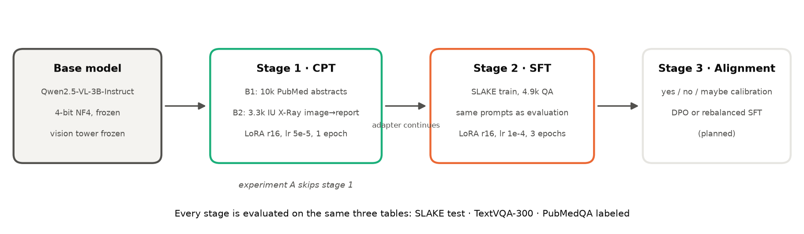
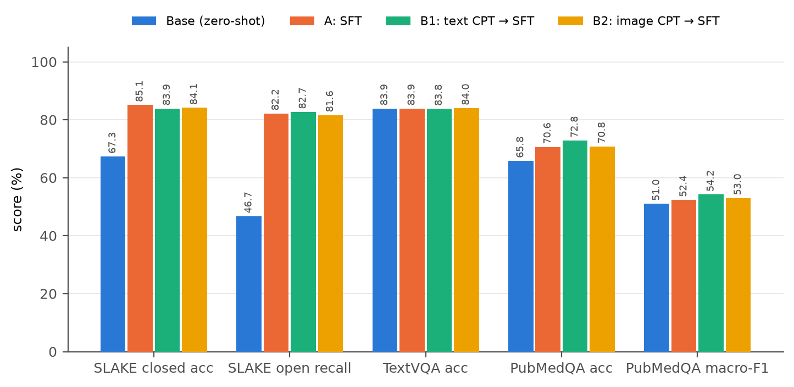
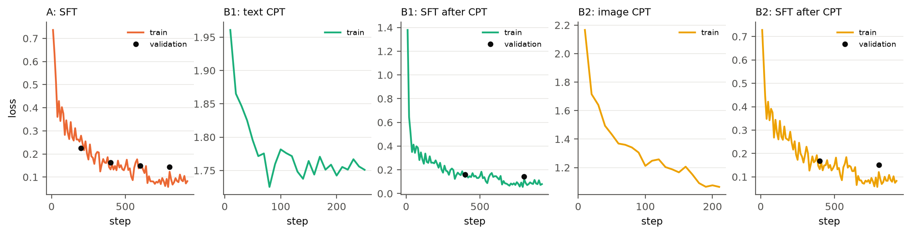
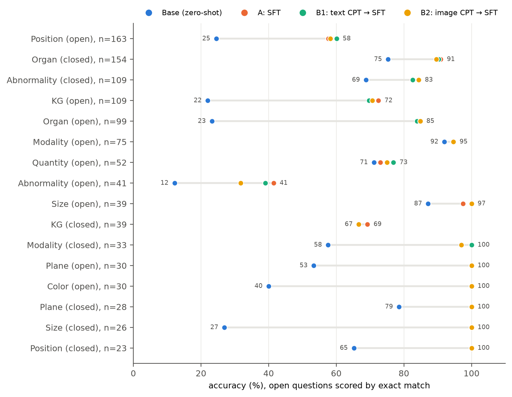
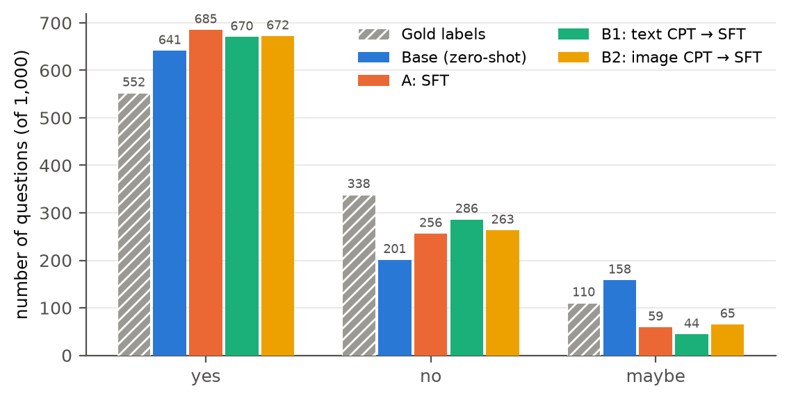

# Parameter-Efficient Continued Pre-training and Instruction Tuning of a Medical Vision-Language Model

**Course project, Topic 6 (Task 1.3)** · Draft v0.1, 2026-09-16 · Author: Chunqian Loo

> **Draft status.** Sections 3, 4 and 5 are written from the repository as it stands (base model, experiments 0, A and B1). Experiment B2 (image-text CPT) is running and its numbers are marked `TBD`. Section 2 (Related Work) is an outline with citation placeholders. Everything marked `[TODO]` still needs work. Repository: https://github.com/AugustLoo/MedLoRA

---

## Abstract

Open-weight vision-language models (VLMs) in the 2–7B range answer general visual questions well but lag on medical images. This project studies a parameter-efficient adaptation pipeline, continued pre-training (CPT) followed by LoRA/QLoRA supervised fine-tuning (SFT), for Qwen2.5-VL-3B-Instruct, with three fixed evaluation tables: medical VQA (SLAKE), general-ability retention (TextVQA subset) and answer reliability (PubMedQA). QLoRA SFT on 4.9k SLAKE questions raises closed-question accuracy from 67.3 to 89.2 and open-question recall from 46.7 to 82.2 with no measurable loss on TextVQA. A text-only CPT stage on 10k PubMed abstracts does not transfer to image questions (SLAKE unchanged within ±0.6) but improves text-only medical reasoning (PubMedQA +2.2). `[TODO: one sentence on B2 image-text CPT once results are in]`. The residual errors concentrate in lesion identification and spatial localisation, and a persistent "yes" bias on PubMedQA is identified as the target for the alignment stage. All adapters, data-generation scripts, evaluation code and configurations are released for one-command reproduction.

---

## 1. Introduction

Large VLMs such as Qwen2.5-VL and LLaVA are trained on web-scale natural images. Radiology and pathology images are rare in that data, so out of the box these models mislabel organs, confuse modalities and hedge poorly on medical questions. Full fine-tuning of even a 3B model is out of reach for a single consumer GPU, which motivates parameter-efficient methods: low-rank adapters (LoRA) and their 4-bit variant (QLoRA) train under 2% of the parameters and fit on a 16 GB card.

Task 1.3 of the course asks for a complete pipeline on a 2–7B open VLM: (1) continued pre-training on medical corpora, (2) LoRA/QLoRA instruction tuning, (3) an alignment step, with four deliverables: data-generation scripts, the CPT/SFT pipeline with adapters, evaluation sets with model cards, and a report with reproducible configurations.

This report makes the following contributions:

1. A reproducible three-table evaluation protocol (medical VQA, general retention, reliability) shared by every experiment, with prompts fixed once and used identically for training data generation and evaluation.
2. A controlled comparison of SFT alone versus CPT followed by SFT, on the same base model, adapter rank, learning schedule and evaluation seed.
3. Evidence that text-only CPT does not transfer to image questions, motivating image-text CPT on chest X-ray reports (IU X-Ray, then CheXpert Plus).
4. A question-type error analysis that separates "vocabulary alignment" gains from genuine gains in medical perception.

The rest of the report is organised as follows. Section 2 reviews related work. Section 3 describes the pipeline. Section 4 gives the datasets and experimental setup. Section 5 reports results, Section 6 discusses them, Section 7 lists limitations and planned work, and Section 8 gives reproduction instructions.

---

## 2. Related Work `[TODO: expand to ~1 page, add citations]`

- **General VLMs.** Qwen2.5-VL [ref], LLaVA-1.5 / LLaVA-NeXT [ref], InternVL [ref]. Architecture: ViT vision tower, projector, decoder-only LLM. Dynamic-resolution vision tokens in Qwen2.5-VL.
- **Medical VLMs.** LLaVA-Med [ref] (two-stage: caption alignment on PMC figure-caption pairs, then instruction tuning); Med-Flamingo [ref]; BiomedGPT [ref]; CheXagent [ref]; RadFM [ref]. Note that LLaVA-Med's first stage is exactly image-caption CPT, which our B2 experiment reproduces at small scale.
- **Parameter-efficient fine-tuning.** LoRA [Hu et al. 2021], QLoRA [Dettmers et al. 2023] (4-bit NF4 base weights, paged optimisers). Reported to match full fine-tuning on instruction tasks at a fraction of memory.
- **Continued pre-training for domain adaptation.** Gururangan et al. 2020 (don't stop pretraining), BioMedLM / PubMedBERT [ref], Med-PaLM [ref]. Open question addressed here: does text CPT help a *multimodal* downstream task.
- **Catastrophic forgetting in fine-tuned VLMs.** Rehearsal / replay [ref], LoRA as implicit regulariser [ref], evaluation on general VQA after domain SFT [ref].
- **Benchmarks.** SLAKE [Liu et al. 2021], VQA-RAD [ref], PubMedQA [Jin et al. 2019], TextVQA [Singh et al. 2019], IU X-Ray / OpenI [Demner-Fushman et al. 2016], CheXpert Plus [Chambon et al. 2024], MIMIC-CXR [Johnson et al. 2019].

---

## 3. Method

### 3.1 Pipeline overview

```
base model ──► (stage 1) CPT adapter ──► (stage 2) SFT adapter ──► (stage 3) alignment  [planned]
Qwen2.5-VL-3B     medical corpus           SLAKE train                 preference data
                  text or image-text       instruction format          (yes/no/maybe calibration)
```

Each stage produces a LoRA adapter on the same frozen 4-bit base. Stage 2 is initialised from the stage-1 adapter (`adapter_name_or_path`) and continues training the same low-rank matrices, so the final artefact is a single 120 MB adapter. Experiment A skips stage 1; experiments B1/B2 differ only in the stage-1 corpus.



*Figure 1. The three-stage pipeline. Every adapter is evaluated on the same three tables.*

### 3.2 Base model

Qwen2.5-VL-3B-Instruct (Apache-2.0): a 3.75B-parameter model with a native-resolution ViT, an MLP projector and a Qwen2.5 decoder. It was chosen because (i) it sits in the 2–7B range required by the task, (ii) it fits on a 16 GB T4 in 4-bit with room for activations, and (iii) it already follows short-answer instructions, which makes zero-shot baselines meaningful.

### 3.3 Parameter-efficient training (QLoRA)

- Base weights quantised to 4-bit NF4 with double quantisation (bitsandbytes); LoRA matrices and optimiser states in fp16.
- LoRA on every linear layer of the language model (`lora_target: all`), rank 16, α = 32, dropout 0.05. The vision tower and projector are frozen in all experiments, so any change in behaviour is attributable to the LLM side.
- Gradient checkpointing, effective batch 16 (2 × 8 accumulation), cosine schedule, seed 42. Training is done with LLaMA-Factory; one YAML per experiment under `configs/`.

### 3.4 Stage 1a: text-only CPT (B1)

Causal-LM loss on 10,000 PubMedQA `pqa_artificial` documents (question + abstract context + long answer, concatenated), packed into 1024-token sequences. Learning rate 5e-5 (half of SFT), one epoch. The evaluation split `pqa_labeled` is never used for training.

### 3.5 Stage 1b: image-text CPT (B2)

Caption-style alignment in the sense of LLaVA-Med stage 1: the input is a frontal chest X-ray plus a fixed instruction ("Write the radiology report for this chest X-ray."), the target is the report's Findings and Impression sections, and the loss is computed on the report tokens only. Implemented as an SFT-format dataset so that images are consumed; hyper-parameters as in 3.4. Corpus: IU X-Ray (see 4.1); CheXpert Plus is the planned scale-up.

### 3.6 Stage 2: instruction tuning (SFT)

SLAKE English training questions converted to a two-turn chat format with the same prompt templates used at evaluation time (`medvlm/prompts.py`):

- closed questions: `{question}\nAnswer with yes or no only.`
- open questions: `{question}\nAnswer with a single word or short phrase.`

Learning rate 1e-4, three epochs, images resized to at most 512×512 pixels (262,144), validation loss on the SLAKE validation split every 400 steps.

### 3.7 Stage 3: alignment `[planned]`

The PubMedQA results (Section 5) show a stable over-prediction of "yes" and under-prediction of "maybe". The planned alignment step is DPO on preference pairs constructed from PubMedQA `pqa_artificial` (preferred: the gold label; rejected: the model's over-confident answer), evaluated on `pqa_labeled` macro-F1 and the maybe rate. `[TODO: decide DPO vs. simple label-rebalanced SFT after B2]`

---

## 4. Data and Experimental Setup

### 4.1 Datasets

| Dataset | Role | Size used | Licence / access |
|---|---|---|---|
| SLAKE (English) | SFT training; validation loss; **test set for medical VQA** | train 4,919 / val 1,053 / test 1,061 (416 closed, 645 open) | CC BY 4.0 |
| PubMedQA `pqa_artificial` | text CPT corpus | 10,000 documents | MIT |
| PubMedQA `pqa_labeled` | **reliability evaluation** (yes/no/maybe) | 1,000 | MIT, never trained on |
| TextVQA validation | **general-ability retention** | fixed 300-question sample, seed 42 | CC BY 4.0 |
| IU X-Ray (OpenI, Kaggle mirror) | image-text CPT prototype | ≈3.3k frontal images with non-empty reports, 95/5 split by report id | public |
| CheXpert Plus | image-text CPT at scale (planned, B3) | 5k → 20k studies | registered; download pending |

MIMIC-CXR was in the original task description; CheXpert Plus was chosen instead because it provides the same image-report structure with a lighter access process (registration versus PhysioNet credentialing), and because it is the dataset shared with the Topic 1 teammate whose image-text alignment model will provide the data-filtering scores for B3.

Compliance rules fixed in the repository: SLAKE test and PubMedQA labeled are evaluation-only; patient-level splits are stored in git; controlled data and patient-level derived files never enter git or public Kaggle datasets.

### 4.2 Evaluation protocol

All three tables are produced by `train/eval_all.sh <tag> <adapter>` with greedy decoding (`do_sample=False`), at most 32 new tokens, images capped at 512×512, on the full-precision fp16 base plus adapter. Predictions are stored per question for error analysis.

| Table | Data | Metrics |
|---|---|---|
| Medical VQA | SLAKE test | closed: accuracy after folding the answer to yes/no; open: exact match, token recall (LLaVA-Med convention) and token F1, all after lower-casing, stripping punctuation and articles; both split by modality (X-Ray / CT / MRI) |
| General retention | TextVQA 300 | VQA accuracy, min(#matching annotators / 3, 1) |
| Reliability | PubMedQA labeled | accuracy, macro-F1 over {yes, no, maybe}, predicted-label distribution versus gold (552 / 338 / 110) |

### 4.3 Hardware and cost

All training and evaluation ran on Kaggle (one NVIDIA T4, 16 GB, fp16). A local RTX 3050 (4 GB) was used only for code and smoke tests.

| Run | Samples | Wall time | Throughput |
|---|---|---|---|
| Baseline evaluation (3 tables) | – | ≈1.5 h | SLAKE 1,061 questions in 38 min |
| A: SLAKE SFT, 3 epochs | 4,919 × 3 | 4 h 28 min | 0.92 samples/s |
| B1: text CPT, 1 epoch | 10,000 packed | 2 h 39 min | 0.42 samples/s |
| B1: SFT after CPT | 4,919 × 3 | 4 h 07 min | 1.0 samples/s |
| B2: image-text CPT + SFT | `TBD` | `TBD` | `TBD` |

### 4.4 Experiment matrix

| ID | Stage 1 | Stage 2 | Question answered | Status |
|---|---|---|---|---|
| 0 | – | – | zero-shot starting point | done |
| A | – | SLAKE SFT | gain from instruction tuning alone | done |
| B1 | text CPT (PubMedQA) | SLAKE SFT | does text CPT transfer to image VQA | done |
| B2 | image-text CPT (IU X-Ray) | SLAKE SFT | does image-report CPT transfer | running |
| B3 | image-text CPT filtered by alignment score (CheXpert Plus) | SLAKE SFT | value of data-quality filtering | needs teammate interface |
| C | best of B | SFT + general VQA replay (5 % / 10 %) | forgetting mitigation | planned |
| D | ablations: rank 8/16/32, CPT size, lr, epochs | | which factor matters | planned |
| E (optional) | C + DPO | | reliability | planned |

---

## 5. Results

### 5.1 Main table

| Metric | Base (0) | A: SFT | B1: text CPT → SFT | B2: image CPT → SFT |
|---|---|---|---|---|
| SLAKE closed acc | 67.31 | **89.18** | 88.70 | `TBD` |
| SLAKE open EM | 40.62 | 75.35 | **75.81** | `TBD` |
| SLAKE open recall | 46.73 | 82.17 | **82.72** | `TBD` |
| SLAKE open F1 | 47.53 | 81.56 | **82.07** | `TBD` |
| SLAKE closed, X-Ray / CT / MRI | 80.70 / 64.49 / 56.82 | 91.23 / 86.45 / 93.18 | 91.23 / 85.51 / 93.18 | `TBD` |
| TextVQA acc (retention) | 83.89 | 83.89 | 83.78 | `TBD` |
| PubMedQA acc | 65.80 | 70.60 | **72.80** | `TBD` |
| PubMedQA macro-F1 | 51.03 | 52.38 | **54.19** | `TBD` |
| PubMedQA predicted yes / no / maybe (gold 552 / 338 / 110) | 641 / 201 / 158 | 685 / 256 / 59 | 670 / 286 / 44 | `TBD` |

Training curves: A, train loss 0.736 → 0.082, validation loss 0.225 → 0.145 still decreasing at epoch 3; B1 CPT loss 1.96 → 1.75 over one epoch; B1 SFT validation loss 0.160 → 0.142. No NaN in any run.



*Figure 2. Main results across the three evaluation tables.*



*Figure 4. Training loss (line) and validation loss (dots) for each run.*

### 5.2 Results by question type (SLAKE test, accuracy; open questions use exact match)

| Type | n | Base | A | B1 | B1 − A |
|---|---|---|---|---|---|
| Position, open | 163 | 24.5 | 57.7 | 60.1 | +2.5 |
| Organ, closed | 154 | 75.3 | 90.9 | 90.3 | −0.6 |
| Abnormality, closed | 109 | 68.8 | 82.6 | 82.6 | 0.0 |
| Knowledge-graph, open | 109 | 22.0 | 72.5 | 69.7 | −2.8 |
| Organ, open | 99 | 23.2 | 84.8 | 83.8 | −1.0 |
| Modality, open | 75 | – | 94.7 | 94.7 | 0.0 |
| Quantity, open | 52 | – | 73.1 | 76.9 | +3.8 |
| Abnormality, open | 41 | 12.2 | 41.5 | 39.0 | −2.4 |
| Modality / Plane / Colour / Size, closed | 91 | 26.9–78.6 | 100.0 | 100.0 | 0.0 |

Per-question changes: base → A fixed 345 questions and broke 30; A → B1 fixed 15 and broke 14.



*Figure 3. SLAKE test accuracy by question type. The grey bar spans base → A; the largest gains are on vocabulary-bound types (Organ, KG, Colour, Plane), the smallest on Abnormality and Position.*

### 5.3 Experiment B2 `[TBD]`

`[TODO: main-table column, per-type table, and the three CPT smoke-test report generations (gold vs. predicted) from the notebook]`

---

## 6. Analysis

**Where SFT gains come from.** The largest jumps after SFT are on Organ (+61.6 open), Knowledge-graph (+50.5) and the closed Modality/Plane/Colour/Size types (to 100 %). These are questions the base model could already perceive but answered with the wrong vocabulary or format ("the lungs" versus "lung", full sentences versus a phrase). SFT is largely *vocabulary and format alignment* here. Genuine perception questions moved less: Abnormality-open reaches only 41.5 % and Position-open 57.7 %. Remaining errors are left/right and upper/lower confusions and lesion-category mix-ups.

**MRI: data, not capacity.** MRI was the weakest modality at baseline (56.8) and becomes the strongest after SFT (93.2). SLAKE's training set is MRI-heavy, so the base model lacked domain exposure rather than the ability to read MR images.

**Text CPT does not cross the modality gap.** B1 and A are indistinguishable on SLAKE: every metric within ±0.6, per-question changes 15 fixed versus 14 broken. Two explanations, both plausible: the CPT corpus (abstract-level biomedical text) does not contain the localisation and lesion vocabulary SLAKE tests, and CPT updates only the LLM while the vision side is frozen. The CPT stage is nevertheless effective in its own domain: PubMedQA improves by 2.2 accuracy and 1.8 macro-F1. This motivates image-text CPT (B2) as the only CPT variant that can plausibly help the primary metric.

**Forgetting is not measurable with the current probe.** TextVQA is unchanged after SFT and after CPT+SFT (83.89 / 83.89 / 83.78). Of the 300 answers, 81 differ from the base only in capitalisation. LoRA with a frozen vision tower and 3 epochs on 4.9k examples is a mild intervention, but the probe is also blunt: short-answer OCR questions are close to the SFT output format. A more sensitive general benchmark (open-ended description or an MMBench subset) is needed before experiment C can show anything. `[TODO: choose and run the second retention probe]`

**Reliability worsens in a specific way.** Every fine-tuning stage increases willingness to commit: predicted "maybe" falls from 158 (base) to 59 (A) to 44 (B1) against 110 gold, while "no"→"yes" errors remain at 92. Accuracy rises because SLAKE-style short-answer training removes hedging, not because calibration improves. This is the concrete target for stage 3.



*Figure 5. PubMedQA predicted-label counts versus gold. Each fine-tuning stage shrinks "maybe" further below its true frequency.*

---

## 7. Limitations and Planned Work

- Single seed per experiment; differences under ±1 point are treated as noise rather than tested statistically. `[TODO: at least 2 seeds for the headline A-vs-B comparison if compute allows]`
- Evaluation uses greedy decoding and string matching; open-ended recall rewards verbose answers. Exact match and F1 are reported alongside to bound this.
- The vision tower is frozen throughout. Unfreezing it (or LoRA on the ViT) is a natural ablation for B2 but roughly doubles memory.
- Image-text CPT is prototyped on IU X-Ray (3.3k frontal images). CheXpert Plus is registered but not yet downloaded; the 5k → 20k scale-up and alignment-score filtering (B3) depend on it and on the teammate's scoring interface (week 6).
- Kaggle's 30 h/week GPU quota bounds throughput at roughly three full experiments per week; the college Docker GPU server, once available, removes the 4-bit requirement (bf16, larger batch).

---

## 8. Reproducibility

```bash
git clone https://github.com/AugustLoo/MedLoRA && cd MedLoRA
pip install -r requirements.txt
pip install "llamafactory[torch,metrics] @ git+https://github.com/hiyouga/LLaMA-Factory.git"

python data/download_slake.py && python data/convert_slake_sharegpt.py
python data/download_pubmedqa.py && python data/convert_pubmedqa_cpt.py --max 10000
python data/convert_iu_xray.py --root <IU_XRAY_DIR> --max 5000      # B2 only

bash train/eval_all.sh baseline                                       # experiment 0
llamafactory-cli train configs/sft_slake_qlora.yaml                   # A
bash train/eval_all.sh sft_r16 outputs/sft_slake_qlora_r16
llamafactory-cli train configs/cpt_pubmed_qlora.yaml                  # B1
llamafactory-cli train configs/sft_after_cpt.yaml
bash train/eval_all.sh cpt_sft_r16 outputs/sft_after_cpt_r16
llamafactory-cli train configs/cpt_iu_qlora.yaml                      # B2
llamafactory-cli train configs/sft_after_cpt_iu.yaml
bash train/eval_all.sh cpt_iu_sft_r16 outputs/sft_after_cpt_iu_r16
```

Every run is fully specified by one YAML (seed 42) and one evaluation tag; the JSON summaries in `results/` are the exact files behind Section 5. Kaggle notebooks that execute the sequences above end-to-end are under `notebooks/`.

---

## References `[TODO: fill in, BibTeX in docs/refs.bib]`

1. Qwen2.5-VL technical report.
2. Hu et al., LoRA: Low-Rank Adaptation of Large Language Models, 2021.
3. Dettmers et al., QLoRA: Efficient Finetuning of Quantized LLMs, 2023.
4. Li et al., LLaVA-Med, 2023.
5. Liu et al., SLAKE, 2021.
6. Jin et al., PubMedQA, 2019.
7. Singh et al., TextVQA, 2019.
8. Demner-Fushman et al., OpenI / IU chest X-ray collection, 2016.
9. Chambon et al., CheXpert Plus, 2024.
10. Gururangan et al., Don't Stop Pretraining, 2020.
11. Zheng et al., LLaMA-Factory, 2024.
